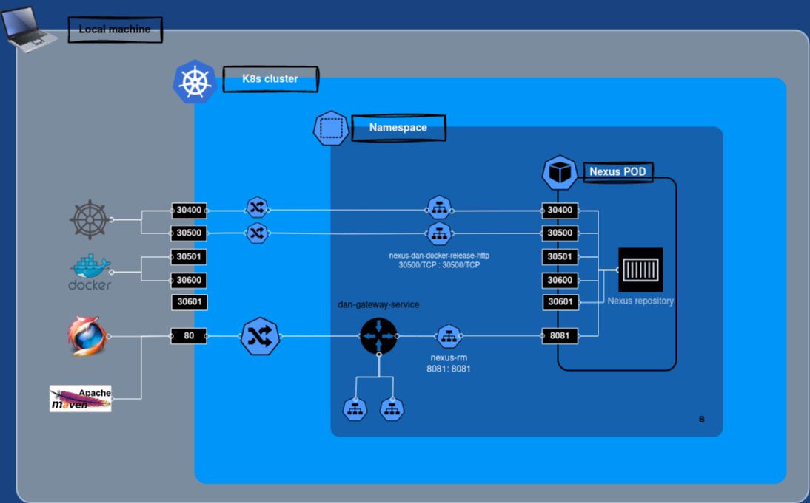
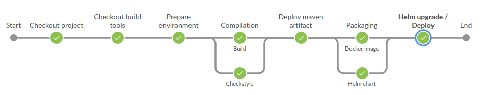

# My PoC about an all-what-you-need, cloud native, microservice oriented platform running on a K8s cluster

Here is my idea about a cloud native, microservice oriented platform running on a K8s cluster.
In my examples all microservices are written in Java, but all the platform components are language agnostic and may work
with any microservice implementing some standard protocol.

You will see a bunch of application / repositories, that can be divided into 3 different classes:

* **Platform components.** I.e. monitoring tools, kafka cluster, database, pipeline, etc. Basically all what you need to
  run and monitor a distributed system.
* **Java Technical platform libraries.** Mainly the parent POM and a custom spring boot starter library providing common
  configuration for high availability, resiliency, rolling restart, etc.
* **Business logic microservices.** Some Spring Boot based java services meant to test the platform features, measuring
  throughput, resiliency, etc.

## Platform components

All what you need to run and monitor a distributed system.

* [Kafka](#kafka)
* [Zipkin](#zipkin)
* [Consul](#consul)
* [Jenkins](#jenkins)
* [Maria DB](#maria-db)
* [ELK stack](#elk-stack)
* [Fluent Bit](#fluent-bit)
* [Nexus Repository](#nexus-repository)
* [Prometheus / Grafana](#prometheus--grafana)

### Kafka

A _Kafka cluster_ is deployed in the cluster thanks to the [strimzi](https://strimzi.io/) operator.  
_Kafka topics_ are deployed via k8s _CRDs_, here - for example - you can see the one related to the java microservice
logs:

```
apiVersion: kafka.strimzi.io/v1beta2
kind: KafkaTopic
metadata:
  name: dan-service-logs
  labels:
    strimzi.io/cluster: dan-kafka-cluster
spec:
  partitions: 10
  replicas: 3
  config:
    retention.ms: 7200000
    segment.bytes: 1073741824
```

**Kafka UI** is also available in the cluster.

### Zipkin

> Zipkin is a distributed tracing system. It helps gather timing data needed to troubleshoot latency problems in service
> architectures.

Java microservices are instrumented (through _zipkin-reporter-brave_ library) to send traces to Zipkin server

```
  zipkin:
    tracing:
      endpoint: http://zipkin:9411/api/v2/spans
```

### Maria DB

_Maria DB_ is up and running for java microservices' needs.

> This chart bootstraps a MariaDB replication cluster deployment on a Kubernetes cluster using the Helm package manager.

### Consul

_Consul_ is used for storing / providing _environment related_ configuration for the java microservices.
As you'll see later, the system is designed in order to acquire configuration in a specific order: the keys provided by
Consul are the ones with the highest priority.
This way, configuration can even be updated at runtime and acquired on the fly by the running services. For example, you
may want to change some log level for debug purposes or update some timeout.

### Jenkins

> The leading open source automation server

Jenkins is in charge tu execute CI / CD pipelines. It requires persistence and therefore 2 volumes are created for it in
the local cluster:

* **jenkins-pv** in order to store jenkins data (pipelines, build history, etc.).
* **jenkins-m2-pv** in order to store a "local" _m2 repository_ for performance reason.

More detailed info about _Jenkins_ can be found in the [CI / CD](#ci--cd) chapter.

### Fluent Bit

> Fluent Bit is a super fast, lightweight, and highly scalable logging and metrics processor and forwarder

Fluent Bit is in charge to read the java microservice logs from the related _kafka topic_, apply some transformation and
forward them to _Elasticsearch_.
Please note that log events are streamed in _JSON_ format in order to be easily parsed and stored by _Elasticsearch_.
More detailed info about logging stack can be found in the [ELK stack](#elk-stack) chapter

### ELK stack

Not really the original _ELK (**E**lasticsearch **L**ogstash **K**ibana)_ stack as I replaced logstash (deprecated in my
views) with _Fluent Bit_.
Those 3 components are used to stream / store / views logs coming from platform components and java microservices.

#### How does it work?

1) All the java microservices stream the _json formatted logs_ against a _kafka topic_.
2) _Fluent Bit_ cluster is in charge do read the logs from kafka, apply some transformation and push them into _
   Elasticsearch_. Also k8s node logs are retrieved and send to Elastic.
3) _Elasticsearch_ stores and index the logs.
4) _Kibana_ provides a powerful UI to the user in order to search / aggregate / inspect such log entries.

### Prometheus / Grafana

Java microservices are instrumented to be observable. Basically they expose a Micrometer API that can be queried in
order to get metrics such as timers, gauges, counters, distribution summaries, etc.
with a dimensional data model that - when paired with a dimensional monitoring system - allows for efficient access to a
particular named metric with the ability to drill down across its dimensions.

#### How does it work?

_Prometheus_ is in charge to scrape all the Java services and store the metrics. Services to be scraped are found thanks
to the following Annotations added to the related k8s services:
> Annotations: \
> &emsp;prometheus.io/path: /prometheus \
> &emsp;prometheus.io/port: 8080 \
> &emsp;prometheus.io/scrape: true

Such annotations are added thanks to the pipeline _Helm chart_ default values, as you will see later.

### Nexus repository

Nexus Repository provides a central platform for storing and provide several build artifacts types. Here it's used for:

* Store release / snapshot _Helm charts_
* Store release / snapshot _Docker images_
* Store release / snapshot _Maven artifacts_
* Provide a Docker hub mirror for a more performant pipeline
* Provide a Maven central mirror for a more performant pipeline

Repositories listed above are reached against fixed port numbers.
For example che _Docker snapshot repository_ is available at port 30501: _nexus-dan-docker-snapshot-http:30501_




> Note :warning:
>
> Deploying Nexus Repository in containers with an embedded database is nor safe for production.
> I did it here in order to have all the PoC related tools running together in my local cluster.

## Features

* [CI / CD](#ci--cd)
* [Observability](#observability)
    * [Tracing](#tracing-and-metrics)
    * [Logging](#logging)
    * [Metrics](#tracing-and-metrics)
* Dashboards
* Log monitoring

### CI / CD

The pipeline - along with the CI / CD stack - is probably the result I liked more of this PoC.
The scope is about deploying the java spring-boot based microservices. When I started implementing it, my goals were:

* Reproducible deployments
* From git commit to deployment
* Avoid pipeline code repetition
* Avoid k8s definition repetition

#### Tech stack

The pipeline stack includes quite a few tools / components:

* Helm
* Maven
* Jenkins
* Docker daemon
* Nexus repository

#### How it works

Pipeline code can be found into [dan-build-tools](https://github.com/danparisi/dan-build-tools) repository.
Main pieces of the puzzle are:

* Dockerfile
* Jenkinsfile
* Maven settings
* Helm templates with some default value

From a chronological point of view, the pipeline executes such operations:

1) [A k8s POD is raised up](#execution)
2) Microservice checkout from GIT
2) Build tools checkout from GIT
3) Environment preparation (i.e. instantiate variables)
4) Compilation and test execution (Maven)
5) Checkstyle analysis
6) [Deploy artifact against Nexus repository](#maven-artifact-deploy)
7) [Package and push Docker image](#docker-package--push)
8) [Package and push Helm chart](#helm-package--push)
9) [Deploy on k8s cluster (Helm upgrade)](#deploy-on-k8s-cluster)



##### Execution

The pipeline is versioned on GIT and checked out by Jenkins.
It's executed in a k8s POD containing 3 containers:

* a **Jenkins agent** container
* a **Docker daemon** container
    * configured with a docker registry mirror running on Nexus repository for performance reason and  
      listing all the docker / helm OCi registries as they need to be whitelisted in order to be available on HTTP (
      without TLS)
* a container containing **JVM and maven** executables
    * mounts a volume containing a local .m2 repo for performance reason

##### Maven artifact deploy

Maven artifacts are deployed on Nexus repositories: the _maven-snapshots_ and _maven-releases_ ones.
Configuration for achieving that is spread between the java
microservices [parent POM](https://github.com/danparisi/dan-service-starter-parent/blob/main/pom.xml)
and the [maven settings](https://github.com/danparisi/dan-build-tools/blob/main/maven/settings.xml) file used by the
pipeline:

```
mvn --settings settings.xml ...
```

##### Docker package / push

The _Dockerfile_ is checked out from
the [dan-build-tools](https://github.com/danparisi/dan-build-tools/blob/main/Dockerfile) repository.
The logic there is quite simple, it's in charge to copy the application jar and run it by adding few JVM arg.
But also note that there's also some extra logic in order to extract _layers_ from the maven artifact JAR, in order to
increase the performance of the docker image packaging when building new versions of the same service.

Docker packaging and pushing operation are handled by _dockerfile-maven-plugin_ configured inside the java
microservices [parent POM](https://github.com/danparisi/dan-service-starter-parent/blob/main/pom.xml).
Images are pushed against _Nexus repository_, whose URL is defined into the same POM:

```
  <docker.repository.internal>nexus-dan-docker-snapshot-http:30501</docker.repository.internal>
  <docker.repository.external>nexus-dan-docker-snapshot-http.k8s.local:30501</docker.repository.external>
```

##### Helm package / push

The _Helm template_ is checked out from
the [dan-build-tools](https://github.com/danparisi/dan-build-tools/tree/main/helm-chart) repository.
It contains templates for the following k8s resources:

* Service
* Ingress
* Deployment
* Service Account
* Horizontal Pod Autoscaler

At the time I'm writing, the most important ones are _Service_ and _Deployment_. Other ones are basically not used (yet)
.
Default values are also provided in
the [helm chart values](https://github.com/danparisi/dan-build-tools/blob/main/helm-chart/values.yaml) file, for
example:

```
replicaCount: 1

imagePullSecrets:
  - name: nexus-release-http-secret
  - name: nexus-snapshot-http-secret

initContainers:
  - name: check-nexus-ready
    image: alpine:latest
    command: [ 'sh', '-c',
      'until wget --timeout=2 --tries=1 -q nexus-rm:8081/nexus;  
      do echo "Waiting for Nexus to be ready"; sleep 2; done; echo "Nexus is ready!";' ]
      
service:
  type: ClusterIP
  port: 8080
  annotations:
    prometheus.io/port: "8080"
    prometheus.io/scrape: "true"
    prometheus.io/path: "/prometheus"

resources:
  requests:
    cpu: 50m
    memory: 128Mi
  limits:
    cpu: 500m
    memory: 512Mi
```

Here are a few notes about such values:

* An _init container_ is added in order to let the main start only right after _Nexus_ repository is up and running.
  Why? To avoid _Crashloopbackoff_ POD status when starting up _minikube or microk8s_ in my local machine. As the
  readiness probe would fail (for _image pull_ reason) much before Nexus is up and running. This would not be needed in
  an always running cluster.
* _Service annotations_ are needed in order to let _Prometheus_ scrape the java microservice _PODs_.
* Resource _limits and requests_ are quite small in order to let the whole platform run in my laptop.

Please note that **such values can be overridden at service level**, the pipeline is smart enough to grab an
additional _values.yaml_ file from the microservice repository and apply it.
For example, all the services are exposed by default on _port 8080_ as you can see from the _ClusterIP_ service related
snippet above. But the _Gateway_ service needs instead to be reachable at _port 80_
in order to be available at the following URL: _http://k8s.local_ from the host machine. You can see such customization
in the gateway
repository [helm/service-values.yaml](https://github.com/danparisi/dan-gateway-service/blob/main/helm/service-values.yaml)
file.
Additionally, [here](https://github.com/danparisi/dan-service-starter-parent/blob/main/pom.xml) you can see how both
helm values files are considered while _upgrading the Helm release_ and their priority order:

```
  <values>
      <yamlFile>${project.basedir}/${project.name}/values.yaml</yamlFile>
      <yamlFile>${project.basedir}/${project.name}/service-values.yaml</yamlFile>
  </values>
```

###### Why two property URLs for the same repository?

The reason is that such repository needs to be reached out from 2 different _"locations"_:

1) During the pipeline execution, the docker daemon running inside a container _(DinD)_ is able to discover the Nexus
   repository by querying the k8s DNS, so basically it can ping the _nexus-dan-docker-snapshot-http_ k8s service.
2) When starting up the java microservice POD inside the cluster, k8s will query the host machine DNS in order to find
   the container image. In order to let it work, an entry containing the _nexus-dan-docker-snapshot-http.k8s.local_ name
   must be present inside _/etc/hosts_ file.

###### How ?

_Helm registry login, packaging, etc._ operations are handled by _helm-maven-plugin_ configured inside the java
microservices [parent POM](https://github.com/danparisi/dan-service-starter-parent/blob/main/pom.xml).
The following maven goals are executed by the pipeline:

1) helm:init
2) helm:dependency-build
3) helm:lint
4) helm:package
5) helm:package
6) helm:registry-login
7) helm:push

##### Deploy on k8s cluster

Nothing special here, the pipeline step is on in charge to execute the _helm:upgrade_ maven goal.

# Observability

> Observability is how well you can understand the internals of your system by examining its outputs.

For a distributed system like microservices, these external outputs are basically known as telemetry data. Such data is
composed by traces, metrics, and logs.
In the last years we saw many vendors trying to find their place in the market with their tools in order to produce,
parse and visualize telemetry data.
The result was the lack of a standard for how to instrument code and send telemetry data to an Observability backend.

**Open telemetry** was born to solve the same problem:

> OpenTelemetry is an Observability framework and toolkit designed to create and manage telemetry data such as traces,
> metrics, and logs.
> Crucially, OpenTelemetry is vendor - and tool - agnostic, meaning that it can be used with a broad variety of
> Observability backends.

## Tracing and Metrics

As the idea is to build java based microservices, it's worth to explain how such applications are instrumented in order
to ship tracing data to a backend.
Spring Boot 3 adopted **Micrometer** and the new distributed tracing support with __Micrometer Tracing__ (basically __
Spring Cloud Sleuth__):

> Micrometer provides a simple facade over the instrumentation clients for the most popular observability systems,
> allowing you to instrument your JVM-based application
> code without vendor lock-in. Think SLF4J, but for observability.

Thanks to this new Observation API, you can easily add observation behaviours to your code to monitor specific
operations. We'll see some example later.
MVC, WebFlux, Jdbc, Feign client, etc. are automatically instrumented by spring boot dependencies, you have all the
monitoring metrics for free.

## Logging

//TODO

---

## Troubleshotting

**_microk8s kubectl_ throws the following error:**

> error: error upgrading connection: error dialing backend: tls: failed to verify certificate: x509

**Solution:**

Run the following commands:

1. sudo microk8s.refresh-certs -e server.crt
2. sudo microk8s.refresh-certs -e front-proxy-client.crt
3. sudo microk8s.refresh-certs -e ca.crt

---

## TODO

### Build tools versioning

Jenkinsfile, helm template, etc.

### Evaluate if replacing the microservice logs streaming against kafka can be avoided in favour of Fluent Bit directly reading them from the containers std output or from k8s nodes if they are stored there as well

#### Props

* Avoid _kafka_ overhead
* Logs are not lost if _Kafka_ cluster is down
* Remove the streaming logic from the services and maybe increase the performance

#### Cons

* If _Fluent Bit_ is down, logs entries may be lost (as there's no kafka storage in between)

---

###### References

* https://opentelemetry.io/
* https://www.baeldung.com/distributed-systems-observability
* https://spring.io/blog/2022/10/12/observability-with-spring-boot-3
* https://peter.bourgon.org/blog/2017/02/21/metrics-tracing-and-logging.html