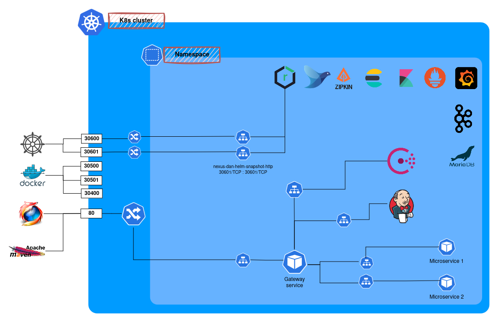

# PoC - A cloud native, microservice oriented platform running on a K8s cluster

Here is my idea about an all-what-you-need cloud native, resilient, observable, microservice oriented platform running
on a Kubernetes cluster.

In my examples all microservices are written in Java, but the platform components are language agnostic and may work
with any microservice implementing standard protocols and APIs mentioned below.

Here are the main chapter of this document:

* [Goals](#goals)
* [Overview](#overview)
* [Features](#features)
* [Installation](#installation)
* [Troubleshooting](#troubleshooting)
* [To Do](#todo)
* [References](#references)

## Goals

At the time I started to design and implement this project, I had in mind clear goals that the whole platform was
supposed to achieve:

### A Platform for a team / department

This project may represent the whole IT stack of a "small" company or a department of a big organization.
The platform is meant to be **observable, fault-tolerant, resilient and cloud-provider-agnostic**.

After running it, you would mainly need to write the business logic only, everything else is supposed to be there.

By following the standards provided here, your business services will be _monitored, observed, resilient,
fault-tolerant, etc._ A kafka cluster and a relational database are also ready to go to be used.
Dashboards and metrics charts will show you their status, workloads, network usage, service-to-service interactions,
CPU, memory and disk space usages, etc., etc., etc.

:warning: Of course this is a PoC, very far to be ready for production.

### Avoid code repetition

**A tech library for (all) the business services**

Code repetition, as long as it's about technical features or configuration, is bad.
For example, you never want to repeat configuration about _circuit breakers, retry patterns, service discovery_, etc.
Also, you don't want to configure _observability, tracing, log streaming_, etc. multiple times.
That's why I designed a library to be included into each business service meant to provide technical configuration for
letting the applications work happily together in a microservice environment.
All those features are configured once and got for free from all the business service. Of course there's always a way to
apply some customization at service level.

**A Helm charts for (all) the business services**

All the business services are meant to be deployed and run on a Kubernetes cluster. For each of them you need few
kubernetes resources such as a _Deployment_, a _Service_, etc.
Again here, code repetition would be bad. As you can immagine, such resource definitions would be (almost) the same for
all the business services, moreover they are quite verbose to be written so for sure you don't want to copy and paste
all of them
for each business service.

In order to template and customize such kubernetes resources I deiced to use **Helm**. But this is not enough in order
to
avoid code repetition between the services, as you don't want to write the helm charts multiple times.
That's why one of the main goal was to have a _pipeline_ able to check out a _Helm charts_ definition to be used for all
the business service and maybe only apply some customization if required for the service that's building.

### A commit-to-deployment pipeline for the business services

One of the core functionality provided is the pipeline, the main goal here is to bring each commit on a main branch to
become a rolling upgrade against the related namespace.
In between of course, there are many steps regarding compilation, checks, packaging, distribution, etc.

### Be compliant with 12factors manifesto

> The twelve-factor app is a methodology for building software-as-a-service apps that:
> * Use declarative formats for setup automation, to minimize time and cost for new developers joining the project;
> * Have a clean contract with the underlying operating system, offering maximum portability between execution
    environments;
> * Are suitable for deployment on modern cloud platforms, obviating the need for servers and systems administration;
> * Minimize divergence between development and production, enabling continuous deployment for maximum agility;
> * And can scale up without significant changes to tooling, architecture, or development practices.

---

## Overview

Here is a small overview about a running instance of the whole project / platform.
Yuo can see 3 layers:

* Local machine
* Kubernetes cluster
* Kubernetes namespace

The k8s cluster is reachable through the _Ingress_ component on fixed ports as you can see below. _Ingress_ is linked to
the _namespace services_.
From the browser, (on http default port 80) you can reach the _Gateway_ and - through it - all the platform tools UIs,
for example:
_http://k8s.local/nexus, http://k8s.local/zipkin/, http://k8s.local/grafana, etc._ Additionally, you can reach the
business services as defined in the gateway routes.
Also note that such routes can be updated on the fly from _Consul UI_.

---

## Features

By feature, I mean all the "topics / components" I focused more.

Detailed description can be found in the following DOCs:

* [Go Native!](README_NATIVE_IMAGES.md) :new:
* [Observability](README_OBSERVABILITY.md)
* [Platform components](README_PLATFORM_COMPONENTS.md)
* [Java Technical platform library(s)](README_JAVA_TECH_PLATFORM.md)
* [Business logic microservices - Use case](README_BUSINESS_MICROSERVICES.md)
* [Continuous integration / Continuous deployment (CI / CD)](README_CI_CD.md)

:information_source: Please note that digging into this GITHUB project, you will see a bunch of application /
repositories. They can
be divided into 3 different sets:

* **Platform components.** I.e. monitoring tools, kafka cluster, database, pipeline, etc. Basically all what you need to
  run and monitor a distributed system.
* **Java Technical platform libraries.** Mainly the parent POM and a custom spring boot starter library providing common
  configuration for business services' high availability, resiliency, rolling update, etc.
* **Business logic microservices.** Some Spring Boot based java services meant to test the platform features, measuring
  throughput, resiliency, etc.

---

## Installation

:construction: TODO... :construction:

---

## Troubleshooting

### **_microk8s kubectl_ throws the following error:**

> error: error upgrading connection: error dialing backend: tls: failed to verify certificate: x509

**Why?**
Usually, it happens when the laptop is connected to a new local network with a different IP address domain (for example
from 198.168.0.X to 198.168.100.X)

**Solution:**

Run the following commands:

1. sudo microk8s.refresh-certs -e server.crt
2. sudo microk8s.refresh-certs -e front-proxy-client.crt
3. sudo microk8s.refresh-certs -e ca.crt

### **Ubuntu process _gvfs-udisks2-vo_ causes High CPU usage**

**Possible solution:**
> sudo tee /etc/udev/rules.d/90-loopback.rules <<EOF \
> SUBSYSTEM=="block", DEVPATH=="/devices/virtual/block/loop*", ENV{UDISKS_PRESENTATION_HIDE}="1", ENV{UDISKS_IGNORE}="
> 1" \
> EOF

**Reference:**

https://github.com/canonical/microk8s/issues/500#issuecomment-811708699

---

## FAQs

**How can I navigate microk8s volumes?**

Go to _/var/snap/microk8s/common/default-storage_

**How can I navigate the database schemas?**

1. From local machine mysql client:

> k port-forward svc/mariadb 3306
>
> mysql -u root -P 3306 -h localhost --protocol=TCP --password=MARIADB_PASSWORD

2. From the utility _mysql-client-pod_ located in this project _/support_ folder:

> k exec -it mysql-client-pod -- sh
>
> mysql -h mariadb --protocol TCP --password=MARIADB_PASSWORD

**How can I consume kafka cluster messages ?**

From the utility _kafka-pod_ located in this project _/support_ folder:

> k exec -it mysql-pod -- bash
>
> kafka-console-consumer.sh --bootstrap-server dan-kafka-cluster-kafka-bootstrap:9092 --topic my-topic-name

---

## TODO

* #### Kafka client for business service logs doesn't reconnect after kafka cluster was offline

* #### Build tools versioning

  Jenkinsfile, helm template, etc.

* #### Evaluate if replacing the microservice logs streaming against kafka can be avoided in favour of Fluent Bit directly reading them from the containers std output or from k8s nodes if they are stored there as well

  ##### Props
    * Avoid _kafka_ overhead
    * Logs are not lost if _Kafka_ cluster is down
    * Remove the streaming logic from the services and maybe increase the performance

  ##### Cons
    * If _Fluent Bit_ is down, logs entries may be lost (as there's no kafka storage in between)

* #### Evaluate if fluentbit helm chart installation can be replaced with fluentbit operator
  * https://github.com/fluent/fluent-operator

* #### Implement checkstyle analysis in the pipeline

* #### Tune JDBC tracing configuration (currently disabled) in order to avoid too much entropy in zipkin charts.

* #### Fix _Generated Server Url_ in Swagger UI when reaching it out from the ingress
  * Check this URL: http://k8s.local/pretrade/swagger-ui/index.html
  * Wrongly generated url example: http://dan-pretrade-service.dan-ci-cd.svc.cluster.local
  * Solutions to be
    tested: https://stackoverflow.com/questions/60625494/wrong-generated-server-url-in-springdoc-openapi-ui-swagger-ui-deployed-behin

* #### Fix pipeline Docker image push in order to choose snapshot or release docker repository according to the POM version
  Basically as is for Helm maven plugin

* #### Jenkins docker DinD - try to keep docker images in order to improve build performance (while building docker image)

* #### Evaluate JIB maven plugin to build / push docker images without relying on host machine docker daemon

* #### ~~Fix Grafana dashboard imports from helm chart~~

  ~~https://github.com/grafana/helm-charts/issues/1385~~

---

## References

* https://opentelemetry.io/
* https://strimzi.io/documentation/
* https://www.marcobehler.com/guides/graalvm-aot-jit
* https://www.baeldung.com/distributed-systems-observability
* https://spring.io/blog/2022/10/12/observability-with-spring-boot-3
* https://peter.bourgon.org/blog/2017/02/21/metrics-tracing-and-logging.html
* https://docs.spring.io/spring-boot/docs/current/reference/html/native-image.html
* https://www.cloudkarafka.com/blog/apache-kafka-retention-and-segment-size-mistake.html
* https://refactorizando.com/en/autoscaling-with-prometheus-and-spring-boot-in-kubernetes/
* https://www.graalvm.org/22.3/reference-manual/native-image/guides/debug-native-image-process/
* Actually many, many more I forgot to report here :)