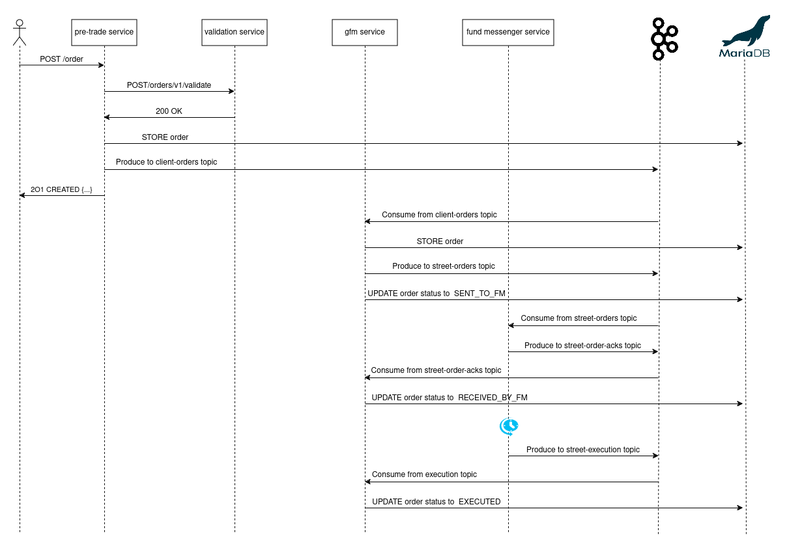
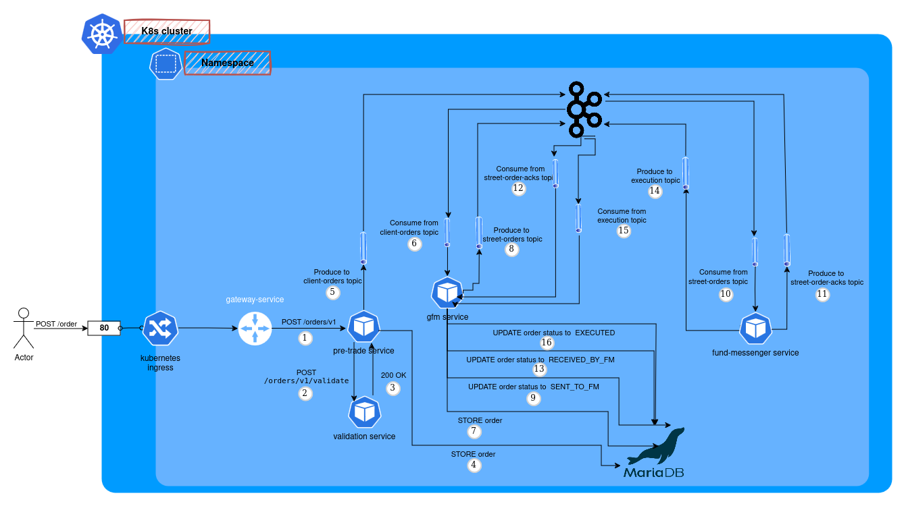

# Business microservices

In order to test and demonstrate all the features provided by the platform, I prepared a fake business flow.
Main idea was to have enough microservices talking each other via different protocols (Rest API / Kafka messages),
and to check business flow processing error rate with very high throughput, cluster instability, etc.
In other words, I mainly wanted to test **resiliency** and **fault tolerance**, but also _latency, throughput, scaling_,
etc.

## Business case example

Here is the case I designed, there's no real logic: basically only service-to-service communication and
some thread sleep in order to simulate internal process or calls to external systems.
The case involves a user, 4 java microservices, the kafka cluster and MariaDB:

The charts above were drawn by me, below instead you can see the Zipkin tracing chart generated by the system.
As you can see, it perfectly reflects the use case I designed:

## Java Architecture

:construction: TODO... :construction:
