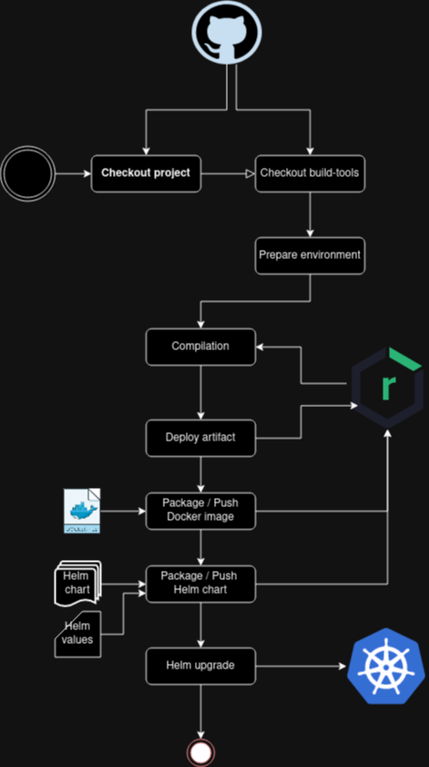

# CI / CD Pipeline

The pipeline - along with the CI / CD stack - is probably the result I liked more of this PoC. \
The scope is about deploying the java spring-boot based microservices against the kubernetes cluster.

When I started implementing it, my goals were:

* Reproducible deployments
* From git commit to deployment
* Avoid pipeline code repetition
* Avoid k8s resource definition repetition


## Tech stack

The pipeline stack includes quite a few tools / components:

* Helm
* Maven
* Jenkins
* Docker daemon
* Nexus repository

## How it works

Pipeline code can be found into [dan-build-tools](https://github.com/danparisi/dan-build-tools) repository.
Main pieces of the puzzle are:

* Dockerfile
* Jenkinsfile
* Maven settings
* Helm templates with some default value

From a chronological point of view, the pipeline executes such operations:

1) [A k8s POD is raised up as Jenkins agent](#execution)
2) Microservice code checkout from GIT
2) Build tools code checkout from GIT
3) Environment preparation (i.e. instantiate variables)
4) Compilation and test execution (Maven)
5) Checkstyle analysis
6) [Deploy artifact against Nexus repository](#maven-artifact-deploy)
7) [Package and push Docker image against Nexus repository](#docker-package--push)
8) [Package and push Helm chart against Nexus repository](#helm-package--push)
9) [Deploy on k8s cluster (Helm upgrade)](#deploy-on-k8s-cluster)

:information_source: Jenkinsfile code can be
found [here](https://github.com/danparisi/dan-build-tools/blob/main/Jenkinsfile)



### Execution

The pipeline is versioned on GIT and checked out by Jenkins.
It's executed in a k8s POD containing 3 containers:

* a **Jenkins agent** container
* a **Docker daemon** container
    * configured with a docker registry mirror running on Nexus repository for performance reason and  
      listing all the docker / helm OCi registries as they need to be whitelisted in order to be available on HTTP (
      without TLS)
* a container containing **JVM and maven** executables
    * mounts a volume containing a local .m2 repo for performance reason

### Maven artifact deploy

Maven artifacts are deployed on Nexus repositories: the _maven-snapshots_ and _maven-releases_ ones.
Configuration for achieving that is spread between the java
microservices [parent POM](https://github.com/danparisi/dan-service-starter-parent/blob/main/pom.xml)
and the [maven settings](https://github.com/danparisi/dan-build-tools/blob/main/maven/settings.xml) file used by the
pipeline:

```
mvn --settings settings.xml ...
```

### Docker package / push

The _Dockerfile_ is checked out from
the [dan-build-tools](https://github.com/danparisi/dan-build-tools/blob/main/Dockerfile) repository.
The logic there is quite simple, it's in charge to copy the application jar and run it by adding few JVM arg.
Note that there's also some extra logic in order to extract _layers_ from the maven artifact JAR to
increase the performance of the docker image packaging when building new versions of the same service.

Docker packaging and pushing operation are handled by _dockerfile-maven-plugin_ configured inside the java
microservices [parent POM](https://github.com/danparisi/dan-service-starter-parent/blob/main/pom.xml).
Images are pushed against _Nexus repository_, whose URL is defined into the same POM:

```
  <docker.repository.internal>nexus-dan-docker-snapshot-http:30501</docker.repository.internal>
  <docker.repository.external>nexus-dan-docker-snapshot-http.k8s.local:30501</docker.repository.external>
```

#### Why two property URLs for the same repository?

The reason is that such repository needs to be reached out from 2 different _"locations"_:

1) During the pipeline execution, the docker daemon running inside a container _(DinD, **D**ocker **In** **D**ocker)_ is
   able to discover the Nexus
   repository by querying the k8s DNS, so basically it can ping the _nexus-dan-docker-snapshot-http_ k8s service.
2) When starting up the java microservice POD inside the cluster, k8s will query the host machine DNS in order to find
   the container image. In order to let it work, an entry containing the _nexus-dan-docker-snapshot-http.k8s.local_ name
   must be present inside _/etc/hosts_ file.

:information_source: Dockerfile code can be
found [here](https://github.com/danparisi/dan-build-tools/blob/main/Dockerfile)

### Helm package / push

The _Helm template_ is checked out from
the [dan-build-tools](https://github.com/danparisi/dan-build-tools/tree/main/helm-chart) repository.
It contains templates for the following k8s resources:

* Service
* Ingress
* Deployment
* Service Account
* Horizontal Pod Autoscaler

At the time I'm writing, the most important ones are _Service_ and _Deployment_. Other ones are basically not used (yet)
.
Default values are also provided in
the [helm chart values](https://github.com/danparisi/dan-build-tools/blob/main/helm-chart/values.yaml) file, for
example:

```
replicaCount: 1

imagePullSecrets:
  - name: nexus-release-http-secret
  - name: nexus-snapshot-http-secret

initContainers:
  - name: check-nexus-ready
    image: alpine:latest
    command: [ 'sh', '-c',
      'until wget --timeout=2 --tries=1 -q nexus-rm:8081/nexus;  
      do echo "Waiting for Nexus to be ready"; sleep 2; done; echo "Nexus is ready!";' ]
      
service:
  type: ClusterIP
  port: 8080
  labels:
    prometheus.io/scrape: "true"
  annotations:
    prometheus.io/port: "8080"
    prometheus.io/scrape: "true"
    prometheus.io/path: "/prometheus"

resources:
  requests:
    cpu: 50m
    memory: 128Mi
  limits:
    cpu: 500m
    memory: 512Mi
```

Here are a few notes about such values:

* An _init container_ is added in order to let the main one start only right after _Nexus_ repository is up and running.
  Why? To avoid _Crashloopbackoff_ POD status when starting up _minikube or microk8s_ in my local machine. As the
  readiness probe would fail (for _image pull_ reason) much before Nexus is up and running. This would not be needed in
  an always running cluster.
* Resource _limits and requests_ are quite small in order to let the whole platform run in my laptop.
* _Service annotations_ are needed in order to let _Prometheus_ scrape the java microservice _PODs_ for metrics.

Please note that **such values can be overridden at service level**, the pipeline is smart enough to grab an
additional _values.yaml_ file from the microservice repository and apply it.
For example, all the services are exposed by default on _port 8080_ as you can see from the _ClusterIP_ service related
snippet above. But the _Gateway_ service needs instead to be reachable at _port 80_
in order to be available at the following URL: _http://k8s.local_ from the host machine. You can see such customization
in the gateway
repository [helm/service-values.yaml](https://github.com/danparisi/dan-gateway-service/blob/main/helm/service-values.yaml)
file.
Additionally, [here](https://github.com/danparisi/dan-service-starter-parent/blob/main/pom.xml) you can see how both
helm values files are considered while _upgrading the Helm release_ and their priority order:

```
  <values>
      <yamlFile>${project.basedir}/${project.name}/values.yaml</yamlFile>
      <yamlFile>${project.basedir}/${project.name}/service-values.yaml</yamlFile>
  </values>
```

#### Helm commands - How ?

_Helm registry login, packaging, etc._ operations are handled by _helm-maven-plugin_ configured inside the java
microservices [parent POM](https://github.com/danparisi/dan-service-starter-parent/blob/main/pom.xml).
The following maven goals are executed by the pipeline:

1) helm:init
2) helm:dependency-build
3) helm:lint
4) helm:package
5) helm:package
6) helm:registry-login
7) helm:push

### Deploy on k8s cluster

Nothing special here, the pipeline step is in charge to execute the _helm:upgrade_ maven goal.
