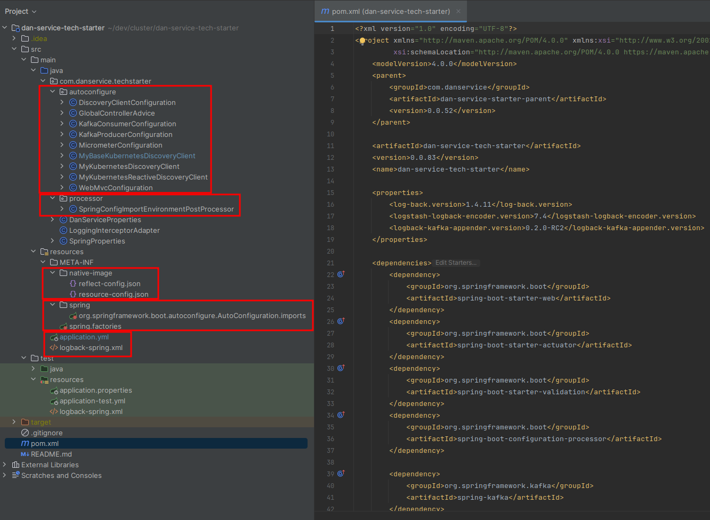
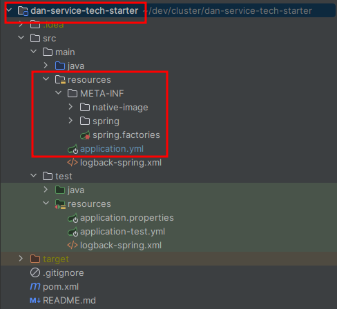
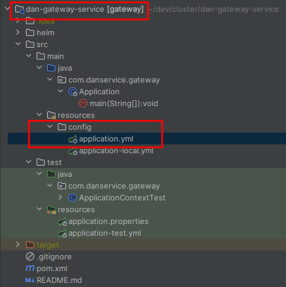
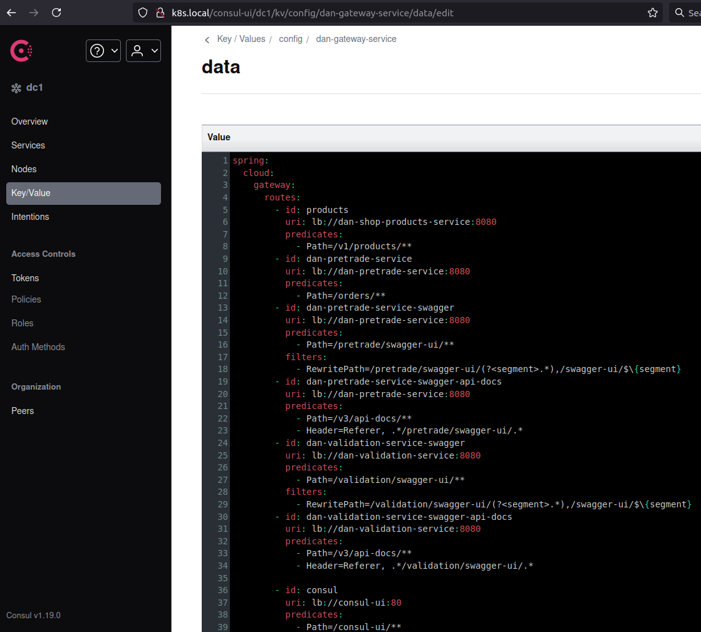
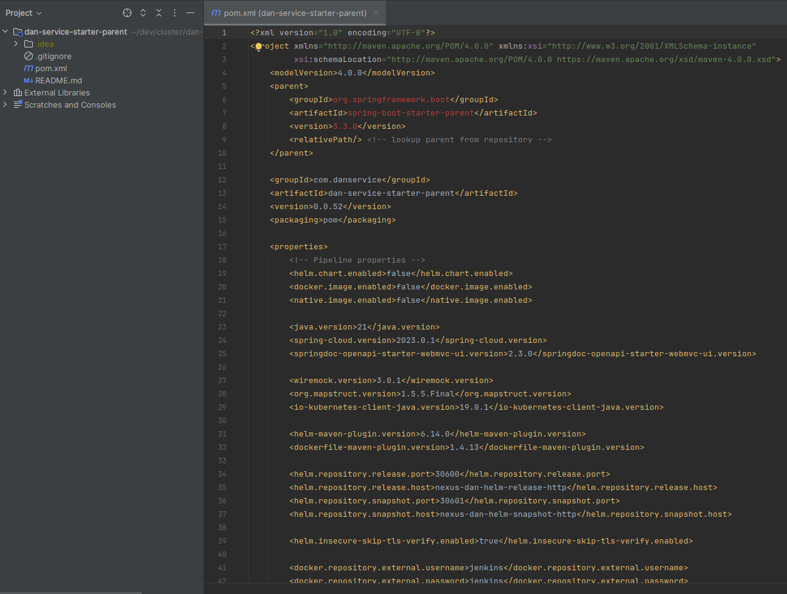

# Java technical platform

The Java technical platform, [dan-service-tech-starter](https://github.com/danparisi/dan-service-tech-starter), is the
library
required as dependency by the Java microservices in order to get for free all the features related to the
_cloud native microservice environment_ and to get all of them happily work and comunicate in a _kubernetes namespace_.

Along with such library, a parent
POM, [dan-service-starter-parent](https://github.com/danparisi/dan-service-starter-parent),
is also required to be inherited in order to provide common dependency versions and build / distribution configuration
(i.e. repositories URLs and ports).

Here is an example of a java microservice POM that by running in my kubernetes cluster would be able to:

- Send traces to Zipkin
- Being scraped by prometheus
- Connect against the kafka cluster
- Discover other java microservices
- Be discovered by other java microservices
- Grab application configuration from Consul
- Stream log events to Elasticsearch through _kafka and fluentbit_
- Automatically retry failing calls against other java microservices
- Open the circuit in case of multiple failing calls against other java microservices
- etc :)

```
<project ...>
    <parent>
        <groupId>com.danservice</groupId>
        <artifactId>dan-service-starter-parent</artifactId>
        <version>X1.Y1.Z1</version>
    </parent>

    <artifactId>pretrade</artifactId>
    <version>X2.Y2.Z2</version>
    <name>dan-pretrade-service</name>

    <properties>
        <helm.chart.enabled>true</helm.chart.enabled>
        <docker.image.enabled>true</docker.image.enabled>
    </properties>

    <dependencies>
        <dependency>
            <groupId>com.danservice</groupId>
            <artifactId>dan-service-tech-starter</artifactId>
            <version>X3.Y3.Z3</version>
        </dependency>

        ...

        <dependency>
            <groupId>org.springframework.boot</groupId>
            <artifactId>spring-boot-starter-test</artifactId>
            <scope>test</scope>
        </dependency>
        <dependency>
            <groupId>org.springframework.kafka</groupId>
            <artifactId>spring-kafka-test</artifactId>
            <scope>test</scope>
        </dependency>
    </dependencies>
</project>
```

:information_source: Following properties are needed to let the pipeline know that a docker image and a helm chart bust
be
created and pushed during the build (more information [here](README_CI_CD.md)):

```
    <helm.chart.enabled>true</helm.chart.enabled>
    <docker.image.enabled>true</docker.image.enabled>
```

## Java technical starter library

The library is the heart of the java microservice framework implementation. It has few lines of code and configuration,
but it took some effort in order to let everything work together. Also writing few related java integration tests and
testing it live in the cluster was quite time-consuming. Overall, I tried to keep the code amount low here, there's
nothing more other than what is going to be discussed in this chapter. You can have a look at the project view here:



### Discovery client

Service discovery is done through kubernetes services, the helm chart coded in
the [dan-build-tools repository](https://github.com/danparisi/dan-build-tools/blob/main/helm-chart/templates/service.yaml),
takes care about creating one for each java
microservice [deployment](https://github.com/danparisi/dan-build-tools/blob/main/helm-chart/templates/deployment.yaml).

The configuration is trivial:

```
spring:
  cloud:
    ...
    kubernetes:
      loadbalancer:
        mode: SERVICE
```

### Circuit breaker / Time limiter / Retry

They are some typical pattern you are supposed to see implemented in any microservice.
Here they are provided by _resilience4j_ implementation of _spring-cloud-circuit-breaker_ interface:

```
spring:
  cloud:
    loadbalancer:
      retry:
        maxRetriesOnNextServiceInstance: 3
    openfeign:
      circuitbreaker:
        enabled: true
      client:
        config:
          default:
            read-timeout: 5000
            connect-timeout: 1000
...

resilience4j:
  circuitbreaker:
    configs:
      default:
        minimumNumberOfCalls: 3
        failureRateThreshold: 50
  timelimiter:
    configs:
      default:
        timeoutDuration: ${spring.cloud.openfeign.client.config.default.read-timeout}
  retry:
    configs:
      default:
        max-attempts: ${spring.cloud.loadbalancer.retry.maxRetriesOnNextServiceInstance}
        waitDuration: 1ms
        retryExceptions:
          - java.net.ConnectException
          - java.net.UnknownHostException
          - java.net.SocketTimeoutException
          - org.apache.http.NoHttpResponseException
          - org.apache.http.conn.ConnectTimeoutException
```

:warning: Note that only few exceptions are supposed to be retried, otherwise you could risk to have some operation
executed twice (unless all your API calls are idempotent).

:information_source: Nice to mention that this spring boot circuit breaker feature was implemented after my request
on [GITHUB](https://github.com/spring-cloud/spring-cloud-commons/issues/1043).

:information_source: In order to test if the combination of such libraries was working as expected, I
wrote [few integration tests](https://github.com/danparisi/dan-service-tech-starter/tree/main/src/test/java/com/danservice/techstarter)
by simulating
multiple service instances (replicas) with _wiremock_.

### Configuration storage in the environment / Consul

In an ideal world, configuration should be the only thing that changes between stages (dev, uat, prod, etc.).
That's why it's important to grab it from the environment. For such purpose I decided to use **Consul**:
Java microservices not only grab their application configuration from it at startup, but it can also be updated on the
fly,
at runtime, from _Consul UI_ and quickly acquired by the related service(s). A real example could be a change to some
logger
level or adding a gateway route, no need to rolling restart any service.

```
spring:
  cloud:
    consul:
      config:
        format: yaml
        enabled: true
        fail-fast: true
        profileSeparator: '-'
        watch:
          enabled: true
      host: consul-server
      port: 8500
  config:
    import: "optional:consul:${spring.cloud.consul.host}:${spring.cloud.consul.port}/"
```

:warning: Note that I
needed [to tune a bit](https://github.com/danparisi/dan-service-tech-starter/blob/main/src/main/java/com/danservice/techstarter/processor/SpringConfigImportEnvironmentPostProcessor.java)
the way Spring Boot implements
the [Externalized Configuration](https://docs.spring.io/spring-boot/docs/current/reference/html/features.html#features.external-config)
because I wanted to keep
the [default configuration](https://github.com/danparisi/dan-service-tech-starter/blob/main/src/main/resources/application.yml)
inside the tech starter library and eventually override it inside
the microservice repo and / or on Consul. This is not possible by default with Spring Boot, that's why I needed to
create an **EnvironmentPostProcessor**.
Here is the priority list according to my implementation:

1. Consul - microservice properties file with spring profile. For
   example: [config/dan-gateway-service-profilename/data](http://k8s.local/consul-ui/dc1/kv/config/dan-gateway-service-profilename/data/edit)
2. Consul - microservice properties file (without any specific profile). For
   example: [config/dan-gateway-service/data](http://k8s.local/consul-ui/dc1/kv/config/dan-gateway-service/data/edit)
3. Microservice repository - properties file with spring profile. For example:
   _service-repository/.../resources/config/properties-profilename.yaml_
4. Microservice repository - properties file (without any specific profile). For example:
   _service-repository/.../resources/config/properties.yaml_
5. dan-service-tech-starter repository - _dan-service-tech-starter/src/main/resources/application.yml_
6. ...

:information_source: For other properties (such as environment variables, etc.) ordering, have a
look [here](https://docs.spring.io/spring-boot/docs/current/reference/html/features.html#features.external-config)

:warning: Note that common configuration is stored on the technical library _main/resources/_ folder while custom
microservice configuration is on _main/resources/config/_ one. Adding any _main/resources/application.yml_ in the
microservice repo would lead to completely override the tech library one and therefore losing the common configuration.

 dan-service-tech-starter                                                                   | dan-gateway-service                                                              
--------------------------------------------------------------------------------------------|---------------------------------------------------------------------------------- 
  |  

You can see below a concrete example about this topic. Spring cloud gateway routing configuration is stored on Consul,
you can add / edit / remove any route, and it will be live immediately:



### Traces and Metrics

For these use cases, we need a few more dependencies. Let's try to explain all of them.

#### Traces dependencies and configuration:

```
    <dependency>
        <groupId>io.micrometer</groupId>
        <artifactId>micrometer-tracing-bridge-brave</artifactId>
    </dependency>

    <dependency>
        <groupId>io.zipkin.reporter2</groupId>
        <artifactId>zipkin-reporter-brave</artifactId>
    </dependency>
```

1) **zipkin-reporter-brave**, in charge of sending the spans to Zipkin server.
2) **micrometer-tracing-bridge-brave**, the _brave_ implementation of the micrometer tracing facade. Used to handle the
   lifecycle of a span.

Here is the configuration related to **tracing** propagation, it's self-explanatory:

```
management:
  tracing:
    sampling:
      probability: 1.0
  zipkin:
    tracing:
      endpoint: http://zipkin:9411/api/v2/spans

jdbc:
  datasource-proxy:
    enabled: false
```

:warning: The `probability: 1.0` may not be the best solution in PROD, especially in case of high throughput, as it may
add some latency.
But it really depends on case by case. For sure, you want to have it in lower stages, for testing / debugging purposes.

:information_source: Note that I disabled JDBC tracing by default as it adds too much entropy inside Zipkin charts, it
just needs to be tuned.
Can anyway be enabled - even from _Consul UI_ - at service level when investigation is required. Related configuration
properties can be
found [here](https://jdbc-observations.github.io/datasource-micrometer/docs/current/docs/html/#appendix-common-application-properties).

:information_source: Java microservices also need to be spot and scraped by _Prometheus_ in order to have metrics there.
This job is a responsibility of the _Prometheus operator_, but a properly labelled kubernetes service linked to the java
microservice
is also required, as explained [here](README_OBSERVABILITY.md).

#### Metrics dependencies and configuration:

```
    <dependency>
        <groupId>io.github.openfeign</groupId>
        <artifactId>feign-micrometer</artifactId>
    </dependency>
    <dependency>
        <groupId>io.micrometer</groupId>
        <artifactId>micrometer-registry-prometheus</artifactId>
    </dependency>
    <dependency>
        <groupId>io.github.resilience4j</groupId>
        <artifactId>resilience4j-micrometer</artifactId>
        <version>2.2.0</version>
    </dependency>

    <dependency>
        <groupId>net.ttddyy.observation</groupId>
        <artifactId>datasource-micrometer-spring-boot</artifactId>
        <version>1.0.3</version>
    </dependency>
```

1) **feign-micrometer**, used to instrument feign clients.
2) **datasource-micrometer-spring-boot**, used to instrument JDBC calls.
3) **resilience4j-micrometer**, used to instrument _Resilience4j_. Basically provides metrics for _circuit breakers,
   retries_, etc.
4) **micrometer-registry-prometheus**, the _Prometheus_ implementation of the _micrometer_ facade. Basically provided
   traces can be read and understood by prometheus backend.

Here is the configuration related to **metrics**, it's self-explanatory:

```
management:
  endpoints:
    web:
      base-path: /
      exposure:
        include: "*"
  metrics:
    distribution:
      percentiles-histogram:
        http.server.requests: true
```

#### Java configuration:

In addition to what explained above, I also needed to implement some Java configuration in order to let everything work
as desired.

##### Kafka observability

_Spring boot kafka_ is not observable by default, it needs to be enabled. This is not yep possible to be done in the
application properties file,
therefore I did it programmatically as you can see here
for [kafka producer](https://github.com/danparisi/dan-service-tech-starter/blob/main/src/main/java/com/danservice/techstarter/autoconfigure/KafkaProducerConfiguration.java)
and [kafka consumer](https://github.com/danparisi/dan-service-tech-starter/blob/main/src/main/java/com/danservice/techstarter/autoconfigure/KafkaConsumerConfiguration.java).

:information_source: Note that I also added 2 additional _span TAGs_ - for _Topic_ and _Key_ values - when producing
kafka messages.

##### Micrometer configuration

Few code lines were also needed in order to expose the java microservice application name tag for Prometheus, as
visible [here](https://github.com/danparisi/dan-service-tech-starter/blob/main/src/main/java/com/danservice/techstarter/autoconfigure/MicrometerConfiguration.java).

---

## The parent POM

The more dependency you have the more maintenance is required, and the risk is to have legacy code sooner.
That's why I really tried to keep it minimal: it basically contains only

* Spring Boot / Spring Cloud dependencies and few other ones.
* All the configuration / plugins required for building the project, the docker image, the helm chart.
* Few configuration required to push / distribute all the artifacts / images against the related repositories.

### Configuration

Most important configurations are probably the ones related to the distribution, for example the following properties:

```
    <helm.repository.release.port>30600</helm.repository.release.port>
    <helm.repository.release.host>nexus-dan-helm-release-http</helm.repository.release.host>
    <helm.repository.snapshot.port>30601</helm.repository.snapshot.port>
    <helm.repository.snapshot.host>nexus-dan-helm-snapshot-http</helm.repository.snapshot.host>
 
    <docker.repository.internal>nexus-dan-docker-snapshot-http:30501</docker.repository.internal>
    <docker.repository.external>nexus-dan-docker-snapshot-http.k8s.local:30501</docker.repository.external>
```

Those repositories and their related ports were configured on Nexus. The _Helm plugin_ is smart enough to understand if
we are publishing a SNAPHOT or a RELEASE (from the service POM version) in order to decide if pushing against the
_snapshot_ or _release_ repository. The Docker plugin lacks such feature, so far I'm always publishing again the
snapshot
repository, but such feature implementation is in my TODO list.

Maven deploy, that's basically pushing the maven artifacts against Nexus repository is configured in the
_distributionManagement_ node:

```
    <distributionManagement>
        <snapshotRepository>
            <id>nexus-server-snapshots</id>
            <url>http://nexus-rm:8081/nexus/repository/maven-snapshots/</url>
        </snapshotRepository>

        <repository>
            <id>nexus-server-releases</id>
            <url>http://nexus-rm:8081/nexus/repository/maven-releases/</url>
        </repository>
    </distributionManagement>
```

:information_source: Repository URLs you see here corresponds to kubernetes services as such code is executed in a
_Jenkins agent POD_ in the kubernetes cluster network.

Here are the services mentioned above:

```
[daniele: ~ (⎈ |N/A:N/A)]$ k get svc | grep nexus
nexus-docker-proxy-http                    NodePort    10.152.183.119   <none>        30400:30400/TCP                                                                    125d
nexus-dan-docker-release-http              NodePort    10.152.183.169   <none>        30500:30500/TCP                                                                    125d
nexus-dan-docker-snapshot-http             NodePort    10.152.183.200   <none>        30501:30501/TCP                                                                    125d
nexus-dan-helm-release-http                NodePort    10.152.183.42    <none>        30600:30600/TCP                                                                    125d
nexus-dan-helm-snapshot-http               NodePort    10.152.183.24    <none>        30601:30601/TCP                                                                    125d
nexus-rm                                   ClusterIP   10.152.183.181   <none>        8081/TCP                                                                           125d
```

Note that Docker and Helm ones are NodePort types in order to be reached out also from outside the kubernetes cluster,
for example in order to grab such images from my laptop running the kubernetes cluster.

:information_source: More information about _Nexus repository_ can be
found [here](README_PLATFORM_COMPONENTS.md#nexus-repository).

:information_source: More information about how the _Jenkins pipeline_ is using such configuration / plugins can be
found [here](README_CI_CD.md).

The parent POM project has no java code, only POM is relevant as you can see below:

