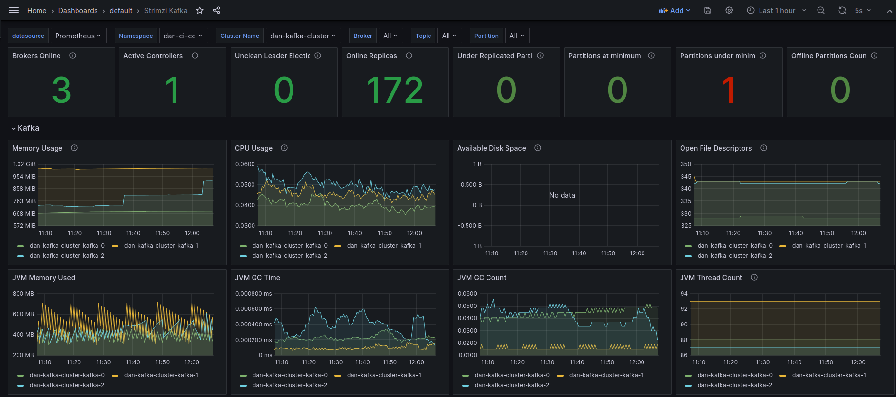
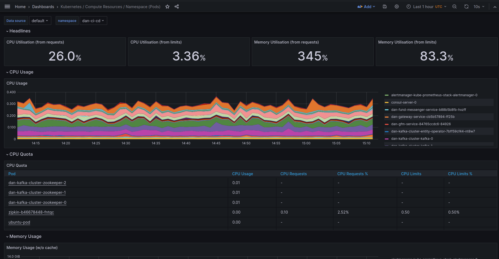
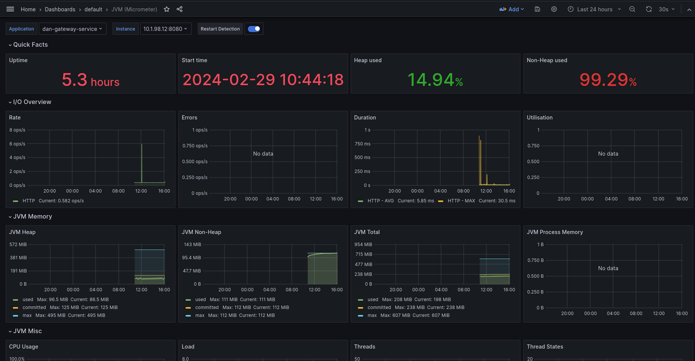
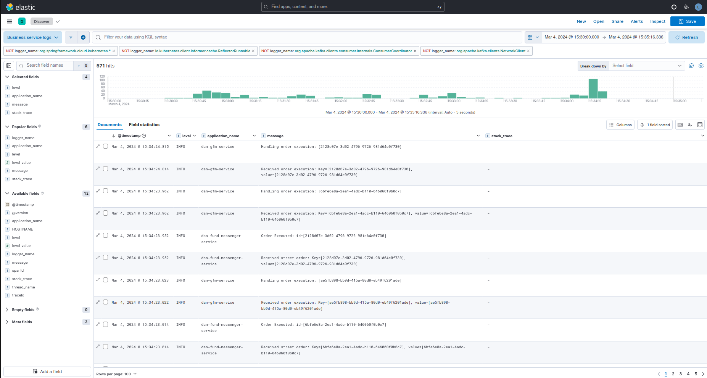
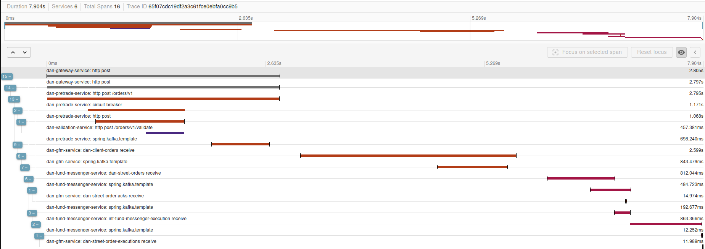
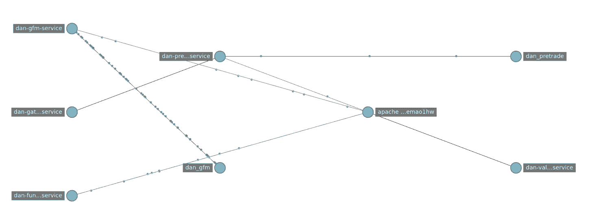

# Observability

> Observability is how well you can understand the internals of your system by examining its outputs.

For a distributed system like microservices, these external outputs are basically known as telemetry data. Such data is
composed by _traces, metrics, and logs_.
In the last years we saw many vendors trying to find their place in the market with their tools in order to produce,
parse and visualize telemetry data.
The result was the lack of a standard for how to instrument code and send telemetry data to an Observability backend.

**Open telemetry** was born to solve the same problem:

> OpenTelemetry is an Observability framework and toolkit designed to create and manage telemetry data such as traces,
> metrics, and logs.
> Crucially, OpenTelemetry is vendor - and tool - agnostic, meaning that it can be used with a broad variety of
> Observability backends.

:information_source: This DOC is mostly about showcasing the implementation result.
Documentation about _observability tools installation_ can be found
in [platform component section](README_PLATFORM_COMPONENTS.md),
while the one about _configuration against the java microservice framework_ can be found
in [java technical platform section](README_JAVA_TECH_PLATFORM.md).

## Tracing and Metrics

As the idea is to build java based microservices, it's worth to explain how such applications are instrumented in order
to ship tracing data to a backend.
Spring Boot 3 adopted **Micrometer** and the new distributed tracing support with __Micrometer Tracing__ (basically
_Spring Cloud Sleuth_):

> Micrometer provides a simple facade over the instrumentation clients for the most popular observability systems,
> allowing you to instrument your JVM-based application
> code without vendor lock-in. Think SLF4J, but for observability.

Thanks to this new Observation API, you can easily add observation behaviours to your code to monitor specific
operations. We'll see some example later.

So far, I added instrumentation configuration for REST APIs, JDBC operations, Feign clients, kafka messages, etc.
It means all such operations can be observed and analyzed.

## Metrics dashboards

Metrics don't really provide such a value until we have a good way to aggregate and visualize them in a user-friendly
UI.
Here is where _Grafana_ comes in: it can be configured to query some datasource (_Prometheus_ in our case) and show data
in intuitive dashboards.

In my cluster installation you will find the following ones:

1) A _Kafka cluster_ monitoring dashboard
2) A _Spring Boot services_ monitoring dashboard
3) Plenty _Kubernetes cluster_ monitoring dashboards

All the dashboards can be found at the following URL: http://k8s.local/grafana/dashboards, here are some examples:

## Logs monitoring

How can you say your system is observable without a smart, user-friendly and easy to navigate way to check components'
logs?
And - of course - you want to easily group them by some order ID (tracing) in order to check the flow throughout all the
components that are involved.

In order to achieve everything I decided to use the _ELK stack_ (as already discussed earlier).
Shortly: logs are streamed from the java services to _kafka_, collected from _fluentbit_, normalized,
and pushed against **Elasticsearch** where they are indexed and stored.

**Kibana** instead, is the tool that lets us read, group, investigate, etc. such log entries them in a nice UI.

My focus was to mainly show the business services logs, but you can have multiple views for other kind of logs:
_kubernetes nodes, kafka cluster, MariaDB_, etc.

At the time I'm writing, 2 views are available: _Java microservices_ logs and _Kubernetes cluster_ logs. Here are some
example:

## Tracing monitoring

In order to store and show in a nice UI all the traces I decided to use **Zipkin Server**.

At the time I'm writing you can nicely see traces propagating through REST API, Kafka messages and JDBC calls.
It means you can follow a whole "order" processing by its corresponding metrics even if few steps are asynchronous.
This is such a great achievement as observability was one of the main features I wanted to have here:
this way you can spot bottlenecks, finds out any slowness points, check the service interactions, etc.

:information_source: I disabled by default JDBC tracing as it adds too much entropy to the zipkin chart according to me.
It can be enabled for all or a specific service by configuration, even from **Consul UI**.

Here you can see some example about **Zipkin UI**:

