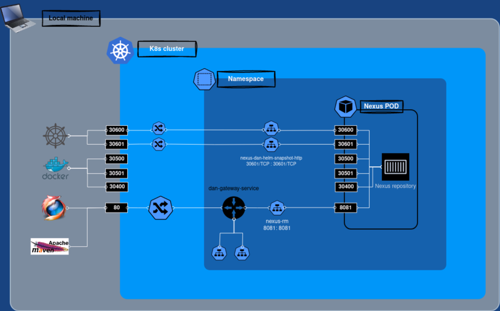

# Platform components

If we consider the Java services that implement the business logic to be the heart of our system, the following
components
can be seen as all the other vital organs of our cluster. Working together, they provide all what you need to run and
monitor our distributed system.

* [Kafka](#kafka)
* [Zipkin](#zipkin)
* [Consul](#consul)
* [Jenkins](#jenkins)
* [Maria DB](#maria-db)
* [ELK stack](#elk-stack)
* [Fluent Bit](#fluent-bit)
* [Nexus Repository](#nexus-repository)
* [Prometheus / Grafana](#prometheus--grafana)

## Kafka

A _Kafka cluster_ is deployed in the cluster thanks to the [strimzi](https://strimzi.io/) operator.  
_Kafka topics_ are deployed via k8s _CRDs_. Here - for example - you can see the one related to the java microservice
logs:

```
apiVersion: kafka.strimzi.io/v1beta2
kind: KafkaTopic
metadata:
  name: dan-service-logs
  labels:
    strimzi.io/cluster: dan-kafka-cluster
spec:
  partitions: 10
  replicas: 3
  config:
    retention.ms: 7200000
    segment.bytes: 1073741824
```

**Kafka UI** is also available in the cluster.

## Zipkin

> Zipkin is a distributed tracing system. It helps gather timing data needed to troubleshoot latency problems in service
> architectures.

Java microservices are instrumented (through _zipkin-reporter-brave_ library) to send traces to Zipkin server

```
  zipkin:
    tracing:
      endpoint: http://zipkin:9411/api/v2/spans
```

## Maria DB

_Maria DB_ is up and running for java microservices' relational database needs.

> This chart bootstraps a MariaDB replication cluster deployment on a Kubernetes cluster using the Helm package manager.

## Consul

_Consul_ is used for storing / providing _environment related_ configuration for the java microservices.
As you'll see later, the system is designed in order to acquire configuration in a specific order: the keys provided by
Consul are the ones with the highest priority.
This way, configuration can even be updated at runtime and acquired on the fly by the running services. For example, you
may want to change some log level for debug purposes or update some timeout.

## Jenkins

> The leading open source automation server

Jenkins is in charge tu execute CI / CD pipelines. It requires persistence and therefore 2 volumes are created for it in
the local cluster:

* **jenkins-pv** in order to store jenkins data (pipelines, build history, etc.).
* **jenkins-m2-pv** in order to store a "local" _m2 repository_ for performance reason.

More detailed info about _Jenkins_ can be found in the [CI / CD](README_CI_CD.md) chapter.

## Fluent Bit

> Fluent Bit is a super fast, lightweight, and highly scalable logging and metrics processor and forwarder

Fluent Bit is in charge to read the java microservice logs from the related _kafka topic_, apply some transformation and
forward them to _Elasticsearch_.
Please note that log events are streamed in _JSON_ format in order to be easily parsed and stored by _Elasticsearch_.
More detailed info about logging stack can be found in the [ELK stack](#elk-stack) chapter

## ELK stack

Not really the original _ELK (**E**lasticsearch **L**ogstash **K**ibana)_ stack as I replaced logstash (deprecated in my
views) with _Fluent Bit_.
Those 3 components are used to _stream / store / view_ logs coming from platform components and java microservices.

### How does it work?

1) All the java microservices stream the _json formatted logs_ to a _kafka topic_.
2) _Fluent Bit_ cluster is in charge to read the logs from kafka, apply some transformation and push them into
   _Elasticsearch_. Also, k8s node logs are retrieved and sent to Elastic.
3) _Elasticsearch_ stores and index the logs.
4) _Kibana_ provides a powerful UI to the user in order to search / aggregate / inspect such log entries.

## Prometheus / Grafana

Java microservices are instrumented to be observable. Basically they expose a _Micrometer API_ that can be queried in
order to get metrics such as timers, gauges, counters, distribution summaries, etc. with a dimensional data model that -
when paired with a dimensional monitoring system - allows for efficient access to a particular named metric with
the ability to drill down across its dimensions.

Also, the Kubernetes cluster itself and basically all components can be instrumented to provide such metrics.
At the time I'm writing I focused on scraping the following entities:

1) Kafka cluster
2) All java microservices
3) Kubernetes cluster (granularity: Nodes, Pods, Namespaces, etc.)

Of course there are many other interesting components that are supposed to be instrumented as well, such as MariaDB,
Elasticsearch, Nexus repository, etc.

### How does it work?

_Prometheus_ is in charge to scrape the components listed above and store the metrics.
The _Prometheus Operator_ finds out what to scrape by monitoring the _PodMonitor_ and _ServiceMonitor_ _CRDs_.

#### PodMonitor

Used to scrape the _kafka cluster_. The configuration is provided by the _strimzi_ operator and can be
found [here](https://github.com/danparisi/homemade-cluster/blob/main/components/kafka/k8s/dan-kafka-cluster.yaml).
In order to let it work, kafka and zookeeper PODs need to expose the metrics, such configuration can be
found [here](https://github.com/danparisi/homemade-cluster/blob/main/components/kafka/k8s/dan-kafka-cluster-metrics-pod-monitor.yaml).

#### ServiceMonitor

Used to scrape the Java spring boot services. Configuration is part of the _kube-prometheus-stack_ helm chart:

> additionalServiceMonitors: \
> &emsp;name: kube-prometheus-stack-spring-boot \
> &emsp;selector: \
> &emsp;&emsp;matchLabels: \
> &emsp;&emsp;&emsp;prometheus.io/scrape: "true" \
> &emsp;&emsp;namespaceSelector: \
> &emsp;&emsp;&emsp;matchNames: \
> &emsp;&emsp;&emsp;&emsp;- dan-ci-cd \
> &emsp;endpoints: \
> &emsp;&emsp;- port: http \
> &emsp;&emsp;interval: 5s \
> &emsp;&emsp;path: /prometheus

As you can see from the _matchLabels_ value, the operator will look for and scrape all the kubernetes services
containing the _prometheus.io/scrape: "true"_ label:
> Annotations: \
> &emsp;... \
> &emsp;prometheus.io/scrape: true

Such label is added thanks to the pipeline _Helm chart_ default values,
visible  [here](https://github.com/danparisi/dan-build-tools/blob/main/helm-chart/values.yaml).

## Nexus repository

Nexus Repository provides a central platform for storing and provide several build artifacts types. Here it's used for:

* Store release / snapshot _Helm charts_
* Store release / snapshot _Docker images_
* Store release / snapshot _Maven artifacts_
* Provide a Docker hub mirror for a more performant pipeline
* Provide a Maven central mirror for a more performant pipeline

Repositories listed above are reached against fixed port numbers.
For example che _Docker snapshot repository_ is available at port 30501: _nexus-dan-docker-snapshot-http:30501_




> Note :warning:
>
> Deploying Nexus Repository in containers with an embedded database is nor safe for production.
> I did it here in order to have all the PoC related tools running together in my local cluster.